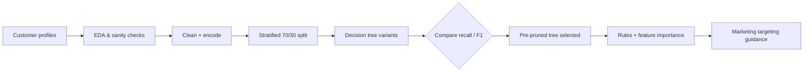
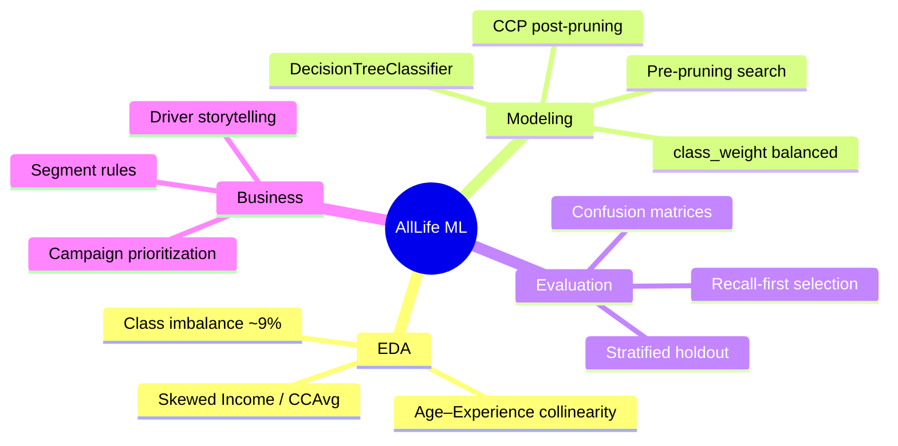

# AllLife Bank — Personal Loan Targeting

<div align="center">

**Sourojit Dhua** · Machine Learning Classification · Banking Analytics

[](https://github.com/sourojitd)
[](https://www.python.org/)
[](https://scikit-learn.org/)
[](https://sourojitd.github.io/AIML-AllLifeBank/)
[](https://sourojitd.github.io/AIML-AllLifeBank/)

<br/>

[](https://sourojitd.github.io/AIML-AllLifeBank/)

</div>

---

## Why this matters

AllLife Bank has a large **liability** (depositor) base and a thin **asset** (borrower) base. A prior personal-loan campaign converted just over **9%**. Marketing needs a sharper list: who is actually likely to accept a loan, so spend concentrates on high-probability customers.

I built an **interpretable decision-tree classifier** that predicts personal-loan uptake, surfaces the attributes that drive acceptance, and gives the retail team segments they can act on — not a black-box score.

**Live site:** [sourojitd.github.io/AIML-AllLifeBank](https://sourojitd.github.io/AIML-AllLifeBank/)  
**Full analysis report:** [`docs/report.html`](./docs/report.html)

---

## Problem → approach → outcome

| Layer | Detail |
| --- | --- |
| **Problem** | Binary classification — will a liability customer accept a personal loan? |
| **Data** | 5,000 customer profiles (demographics, income, spend, product holdings). **Dataset is confidential and not redistributed in this repository.** |
| **Model family** | `DecisionTreeClassifier` variants only (default, `class_weight='balanced'`, pre-pruning, post-pruning) |
| **Selection metric** | **Recall** on a stratified holdout (missed converters cost growth) |
| **Final model** | Pre-pruned tree — `max_depth=6`, `max_leaf_nodes=50`, `min_samples_split=30` |
| **Holdout result** | Accuracy **0.983** · Recall **0.910** · Precision **0.910** · F1 **0.910** |
| **Key drivers** | Income · Family size · Education · Credit-card average spend |

---

## Architecture





---

## Topics & skills demonstrated

<details>
<summary><strong>Exploratory data analysis</strong></summary>

- Univariate profiling for Income, Mortgage, CCAvg, Experience
- Categorical distributions for Education, product flags, and `Personal_Loan`
- Correlation analysis (Age–Experience ≈ 0.99) and target relationship views by age / education
- Explicit treatment of the ~9% minority class before modeling

</details>

<details>
<summary><strong>Data preparation for classification</strong></summary>

- Identifier / non-predictive field handling (e.g. ID, ZIP after checks)
- Education encoding for tree splits
- Stratified train–test split (`test_size=0.30`, `random_state=1`) to preserve class rates

</details>

<details>
<summary><strong>Interpretable supervised learning</strong></summary>

- Baseline trees vs `class_weight='balanced'`
- Hyperparameter **pre-pruning** over `max_depth`, `max_leaf_nodes`, `min_samples_split`
- **Cost-complexity post-pruning** (`ccp_alpha` sweep) with recall-vs-alpha diagnostics
- `export_text` decision rules + feature-importance ranking for stakeholder review

</details>

<details>
<summary><strong>Evaluation discipline</strong></summary>

- Metrics: Accuracy, Precision, Recall, F1 — selection driven by **test recall**
- Confusion-matrix review focused on false negatives (lost loan opportunities)
- Learning-curve check that the chosen complexity generalizes

</details>

<details>
<summary><strong>Business translation</strong></summary>

- Ranked drivers: **Income**, **Family**, **Education**, **CCAvg**
- Segment-style rules (e.g. higher income interacting with education / family size)
- Recommendations for concentrating campaign budget on model-flagged customers

</details>

---

## Model comparison (test set)

| Model | Accuracy | Recall | Precision | F1 |
| --- | ---: | ---: | ---: | ---: |
| Decision Tree (sklearn default) | 0.982 | 0.861 | 0.947 | 0.902 |
| Decision Tree (`class_weight`) | 0.982 | 0.882 | 0.927 | 0.904 |
| **Decision Tree (pre-pruning)** ★ | **0.983** | **0.910** | **0.910** | **0.910** |
| Decision Tree (post-pruning) | 0.982 | 0.903 | 0.909 | 0.906 |

★ Selected for highest test recall with balanced precision.

---

## Repository layout

```text
AIML-AllLifeBank/
├── README.md       # This portfolio brief
└── docs/           # GitHub Pages site + full report
    ├── index.html
    ├── styles.css
    ├── main.js
    └── report.html # Full executed analysis report
```

---

## Stack

- **Python** · **pandas** · **NumPy**
- **matplotlib** · **seaborn**
- **scikit-learn** (`DecisionTreeClassifier`, stratified split, pruning, metrics)
- Analysis delivered as an interactive HTML report (source notebook / raw customer file not published)

---

## Dataset confidentiality

The customer modeling dataset used for this project is **confidential** and is **not included** in this repository. Metrics, charts, and conclusions in [`docs/report.html`](./docs/report.html) reflect the completed analysis; raw rows are withheld.

---

## Explore

1. Open the portfolio site: [GitHub Pages](https://sourojitd.github.io/AIML-AllLifeBank/)
2. Read the full technical report: [`docs/report.html`](./docs/report.html) · [live](https://sourojitd.github.io/AIML-AllLifeBank/report.html)
3. Skim the skills / pipeline sections above for interview-depth talking points

---

<div align="center">

**Built by [Sourojit Dhua](https://github.com/sourojitd)**  
Interpretable ML for banking growth

</div>
